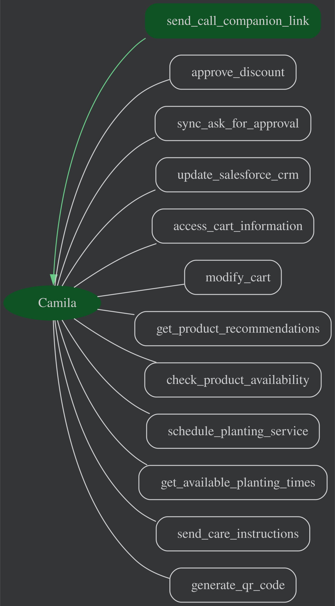

# Agente de Servicio al Cliente de Zapatillas Hat Trick: Camila

Este proyecto implementa un agente de servicio al cliente impulsado por IA para Zapatillas Hat Trick, un negocio especializado en la fabricación y venta de zapatillas de futsal y microfútbol personalizadas. El agente, llamado Camila, está diseñado para brindar un excelente servicio al cliente, ayudar a los clientes con la selección de productos (zapatillas, opciones de personalización y suelas), gestionar pedidos y ofrecer recomendaciones personalizadas.

## Detalles del Agente

Las características clave del Agente de Servicio al Cliente incluyen:

| Característica       | Descripción             |
| ------------------ | ----------------------- |
| _Tipo de Interacción_ | Conversacional          |
| _Complejidad_      | Intermedia            |
| _Tipo de Agente_   | Agente Único            |
| _Componentes_      | Herramientas, Multimodal, Live |
| _Vertical_         | Retail                  |

### Arquitectura del Agente



El agente está construido utilizando una arquitectura multimodal, combinando entradas de texto y potencialmente video (para detalles de las zapatillas o personalización) para proporcionar una experiencia rica e interactiva. Simula interacciones con varias herramientas y servicios, incluyendo un catálogo de productos (zapatillas, opciones de personalización y suelas), gestión de inventario, procesamiento de pedidos y sistemas de comunicación (como WhatsApp). El agente también utiliza un sistema de gestión de sesiones para mantener el contexto entre interacciones y personalizar la experiencia del cliente.

Es importante notar que este agente no está integrado a un backend real y el comportamiento se basa en herramientas simuladas (mocked tools). Si deseas implementar este agente con una integración de backend real, necesitarás editar [customer_service/tools.py](./customer_service/tools/tools.py).

Debido a que las herramientas son simuladas, es posible que algunos cambios solicitados no se apliquen. Por ejemplo, un artículo recién agregado al carrito no se mostrará si más tarde un usuario le pide al agente que liste todos los artículos.

### Características Clave

- **Asistencia al Cliente Personalizada:**
  - Saluda a los clientes recurrentes por su nombre y reconoce su historial de compras (si está disponible).
  - Mantiene un tono amigable, empático y útil, acorde con un negocio deportivo.

- **Identificación y Recomendación de Productos:**
  - Asiste a los clientes en la identificación y selección de modelos de zapatillas (cuero, sintético) según sus necesidades y preferencias.
  - Guía al cliente a través de las opciones de personalización (nombre, número) y selección de suelas (goma, colores y negra, torretin) basada en la superficie de juego.
  - Solicita y utiliza ayudas visuales (como la foto que proporcionaste del modelo Master) o video para mostrar detalles de las zapatillas o ejemplos de personalización.
  - Proporciona recomendaciones de zapatillas a medida basadas en la superficie de juego, estilo de juego y preferencias del cliente.
  - Ofrece alternativas de zapatillas si existen mejores opciones para las necesidades del cliente.

- **Gestión de Pedidos:**
  - Accede y muestra el contenido del carrito de compra de un cliente (modelos de zapatillas, tallas, personalización, suelas).
  - Modifica el carrito agregando y eliminando artículos (zapatillas, personalización) basándose en recomendaciones y la aprobación del cliente.
  - Informa a los clientes sobre ventas y promociones relevantes de Zapatillas Hat Trick.

- **Venta Adicional y Promoción de Servicios:**
  - Sugiere la opción de personalización de nombre y número.
  - Maneja consultas sobre precios y descuentos, explicando los diferentes niveles (detal, minorista, mayorista).
  - Solicita aprobación del gerente para descuentos especiales si es necesario.

- **Soporte y Engagement del Cliente:**
  - Envía (vía sms o correo electrónico) consejos de cuidado para las zapatillas compradas, relevantes para el material y uso.
  - Podría ofrecer un código QR de descuento para futuras compras en la bodega/casa a clientes leales.

- **Interacciones Basadas en Herramientas:**
  - El agente interactúa con el usuario utilizando un conjunto de herramientas adaptadas al negocio de Zapatillas Hat Trick.
  - El agente puede usar múltiples herramientas en una sola interacción.
  - El agente puede usar las herramientas para obtener información y modificar el estado de la transacción del usuario (como el carrito de compras).

- **Evaluación:**
  - El agente puede ser evaluado utilizando un conjunto de casos de prueba.
  - La evaluación se basa en la capacidad del agente para usar las herramientas y responder a las solicitudes del usuario relacionadas con la selección, personalización y compra de zapatillas.

#### Estado del Agente - Información del cliente por defecto
El estado de la sesión del agente se carga previamente con datos de clientes de muestra, simulando una conversación real. Idealmente, este estado debería cargarse desde un sistema CRM al inicio de la conversación, utilizando la información del usuario. Esto asume que el agente autentica al usuario o que el usuario ya ha iniciado sesión. Si se espera que este comportamiento sea modificado, edita [get_customer(current_customer_id: str) en customer.py](./customer_service/entities/customer.py).

#### Tools

El agente tiene acceso a las siguientes herramientas:

* send_call_companion_link(phone_number: str) -> str: Envía un enlace para una videollamada en vivo con el cliente. Usa esta herramienta cuando el cliente acepte compartir video, por ejemplo, para mostrarle opciones de zapatillas en tiempo real.

* approve_discount(type: str, value: float, reason: str) -> str: Aprueba un descuento en calzado, siempre que esté dentro de los límites predefinidos por la promoción.

* sync_ask_for_approval(type: str, value: float, reason: str) -> str: Solicita aprobación de descuento a un gerente o encargado de Hat Trick (versión sincrónica).

* update_salesforce_crm(customer_id: str, details: str) -> dict: Actualiza los registros del cliente en el sistema interno después de que se haya completado una compra.

* access_cart_information(customer_id: str) -> dict: Recupera el contenido actual del carrito del cliente. Úsalo para verificar qué zapatillas ya tiene agregadas antes de recomendar nuevas o modificar el carrito.

* modify_cart(customer_id: str, items_to_add: list, items_to_remove: list) -> dict: Modifica el carrito del cliente agregando o quitando productos. Antes de usar esta herramienta, accede al contenido del carrito para saber qué ya está presente.

* get_product_recommendations(plant_type: str, customer_id: str) -> dict: Sugiere modelos adecuados de zapatillas según la superficie donde juega el cliente (por ejemplo: cemento, baldosa, césped sintético). Antes de recomendar, revisa el carrito y evita sugerir algo que ya tenga.

* check_product_availability(product_id: str, store_id: str) -> dict: Verifica la disponibilidad en inventario de un modelo específico, incluyendo color y talla, en una tienda o punto de venta.

* schedule_planting_service(customer_id: str, date: str, time_range: str, details: str) -> dict: Agenda una cita presencial para prueba de calzado, toma de medidas o entrega del pedido en el taller de Hat Trick.

* get_available_planting_times(date: str) -> list: Muestra los horarios disponibles para agendar una cita presencial (prueba o entrega).

* send_care_instructions(customer_id: str, plant_type: str, delivery_method: str) -> dict: Envía instrucciones de cuidado de las zapatillas al cliente, ya sea por WhatsApp o correo electrónico.

* generate_qr_code(customer_id: str, discount_value: float, discount_type: str, expiration_days: int) -> dict: Crea un código QR con un descuento que puede usarse en tienda física o en la página web durante un tiempo limitado.


## Configuración y Instalación

### Requisitos Previos

- Python 3.11+
- Poetry (para gestión de dependencias)
- Google ADK SDK (instalado a través de Poetry)
- Proyecto de Google Cloud (para la integración con Vertex AI Gemini)

### Instalación

1.  **Requisitos Previos:**

    Para los pasos de despliegue del Agent Engine, necesitarás un Proyecto de Google Cloud. Una vez que hayas creado tu proyecto, [instala el Google Cloud SDK](https://cloud.google.com/sdk/docs/install). Luego ejecuta el siguiente comando para autenticarte con tu proyecto:
    ```bash
    gcloud auth login
    ```
    También necesitas habilitar ciertas APIs. Ejecuta el siguiente comando para habilitar las APIs requeridas:
    ```bash
    gcloud services enable aiplatform.googleapis.com
    ```

2.  Clona el repositorio (o asegúrate de estar en el directorio correcto si ya lo has clonado y adaptado):

    ```bash
    git clone <URL_DEL_TU_REPOSITORIO_ADAPTADO>
    cd <directorio_del_tu_proyecto_zapatillas_hat_trick_agent>
    ```

    **Para el resto de este tutorial, asegúrate de permanecer en el directorio de tu proyecto (ej. `zapatillas-hat-trick-agent`)**.

3.  Instala las dependencias usando Poetry:

    - Si no has instalado Poetry antes, ejecuta `pip install poetry` primero. Luego puedes crear tu entorno virtual e instalar todas las dependencias usando:

    ```bash
    poetry install
    ```

    Para activar el entorno virtual, ejecuta:

    ```bash
    poetry env activate
    ```

4.  Configura las credenciales de Google Cloud:

    - Asegúrate de tener un proyecto de Google Cloud.
    - Asegúrate de tener la API de Vertex AI habilitada en tu proyecto.
    - Configura las variables de entorno `GOOGLE_GENAI_USE_VERTEXAI`, `GOOGLE_CLOUD_PROJECT` y `GOOGLE_CLOUD_LOCATION`. Puedes configurarlas en tu archivo `.env` (modifica y renombra el archivo `.env_sample` a `.env`) o directamente en tu shell. Alternativamente, puedes editar el archivo de configuración (ej. `zapatillas_hat_trick_agent/config.py`).

    ```bash
    export GOOGLE_CLOUD_PROJECT=TU_NOMBRE_DE_PROYECTO_AQUI
    export GOOGLE_GENAI_USE_VERTEXAI=1
    export GOOGLE_CLOUD_LOCATION=us-central1 
    ```
    Asegúrate de actualizar el archivo de configuración (ej. `zapatillas_hat_trick_agent/config.py`) con el nombre del agente ("Camila"), el nombre de la aplicación y el modelo de LLM a utilizar, si estos parámetros están definidos allí.

## Ejecutando el Agente

Puedes ejecutar el agente usando el comando ADK en tu terminal desde el directorio raíz del proyecto:

1.  Ejecutar agente en CLI:

    ```bash
    adk run <nombre_del_modulo_principal_del_agente_ej_zapatillas_hat_trick_agent>
    ```

2.  Ejecutar agente con la Interfaz Web de ADK:
    ```bash
    adk web
    ```
    Selecciona tu agente (`<nombre_del_modulo_principal_del_agente_ej_zapatillas_hat_trick_agent>`) de la lista desplegable.